# Análisis: Sistema de Compras con Costo Promedio

**Fecha:** 2026-02-09
**Proyecto:** API Pretty
**Objetivo:** Implementar registro de compras y sistema de costeo promedio ponderado para gestión de márgenes

---

## 📋 Tabla de Contenidos

1. [Contexto y Motivación](#1-contexto-y-motivación)
2. [Estado Actual del Sistema](#2-estado-actual-del-sistema)
3. [Conceptos: Costo Promedio Ponderado](#3-conceptos-costo-promedio-ponderado)
4. [Diseño Propuesto](#4-diseño-propuesto)
5. [Estructura de Base de Datos](#5-estructura-de-base-de-datos)
6. [Lógica de Cálculo](#6-lógica-de-cálculo)
7. [Flujo de Operaciones](#7-flujo-de-operaciones)
8. [Consideraciones Críticas](#8-consideraciones-críticas)
9. [Plan de Implementación](#9-plan-de-implementación)
10. [Ejemplos Prácticos](#10-ejemplos-prácticos)
11. [Preguntas Clave para Resolver](#11-preguntas-clave-para-resolver)

---

## 1. Contexto y Motivación

### 1.1 Situación Actual
- **NO se registran compras** de mercancía en el sistema
- Solo se hacen **ajustes de inventario** (tipo `AJT`) para entradas
- **No hay control de costos** de compra
- **No se pueden calcular márgenes** de ganancia reales
- **No hay trazabilidad** de qué se compró, cuándo, a quién y a qué precio

### 1.2 Necesidad del Negocio
1. **Gestión de márgenes**: Calcular rentabilidad real por producto
2. **Control de costos**: Saber cuánto cuesta cada artículo en inventario
3. **Toma de decisiones**: Ajustar precios de venta basados en costos reales
4. **Análisis financiero**: Reportes de compras, gastos, rentabilidad por período
5. **Variación de precios**: Detectar incrementos de proveedores y ajustar estrategia

### 1.3 Metodología Elegida: Costo Promedio Ponderado
- **Simplicidad**: Más fácil de implementar que FIFO o LIFO
- **Estabilidad**: Suaviza variaciones de precio
- **Aceptación contable**: Válido en Colombia (NIC 2)
- **Cálculo en tiempo real**: Se actualiza con cada compra

---

## 2. Estado Actual del Sistema

### 2.1 Tablas Relevantes

#### `factura` - Encabezado de documentos
```sql
CREATE TABLE [dbo].[factura](
    [fac_sec] [decimal](12, 0) NOT NULL,           -- PK secuencial
    [fac_fec] [datetime] NOT NULL,                 -- Fecha documento
    [fac_tip_cod] [varchar](5) NOT NULL,           -- Tipo: VTA, COT, AJT
    [nit_sec] [varchar](16) NULL,                  -- Cliente/Proveedor
    [fac_nro] [varchar](15) NULL,                  -- Número: VTA123, AJT45
    [fac_est_fac] [char](1) NULL,                  -- Estado: A=Activo, I=Inactivo, C=Cancelado
    [fac_obs] [varchar](1024) NULL,                -- Observaciones
    ...
)
```

#### `facturakardes` - Detalle de movimientos (kardex)
```sql
CREATE TABLE [dbo].[facturakardes](
    [fac_sec] [decimal](12, 0) NOT NULL,           -- FK a factura
    [kar_sec] [int] NOT NULL,                      -- Secuencial dentro de fac_sec
    [art_sec] [varchar](30) NOT NULL,              -- FK a articulos
    [kar_bod_sec] [varchar](16) NOT NULL,          -- Bodega
    [kar_uni] [decimal](17, 2) NULL,               -- Cantidad
    [kar_nat] [char](1) NULL,                      -- Naturaleza: '+' entrada, '-' salida
    [kar_pre] [decimal](17, 2) NULL,               -- PRECIO DEL MOVIMIENTO (aquí va el costo)
    [kar_pre_pub] [decimal](17, 2) NULL,           -- Precio público
    [kar_sub_tot] [decimal](17, 2) NULL,           -- Subtotal
    [kar_total] [decimal](17, 2) NULL,             -- Total
    ...
)
```

#### `articulos` - Maestro de productos
```sql
CREATE TABLE [dbo].[articulos](
    [art_sec] [varchar](30) NOT NULL,              -- PK
    [art_cod] [varchar](30) NOT NULL,              -- SKU
    [art_nom] [varchar](100) NOT NULL,             -- Nombre
    [inv_sub_gru_cod] [smallint] NOT NULL,         -- Categoría
    ...
)
```

#### `articulosdetalle` - Precios por bodega y lista
```sql
CREATE TABLE [dbo].[articulosdetalle](
    [art_sec] [varchar](30) NOT NULL,
    [bod_sec] [varchar](16) NOT NULL,              -- Bodega (siempre '1')
    [lis_pre_cod] [smallint] NOT NULL,             -- Lista: 1=detal, 2=mayor
    [art_bod_exi] [decimal](17, 2) NULL,           -- Existencia (deprecated, usar vwExistencias)
    [art_bod_pre] [decimal](17, 2) NULL,           -- Precio de venta
    [art_bod_cos_cat] [decimal](17, 2) NULL,       -- **CAMPO EXISTENTE PARA COSTO**
    ...
)
```

#### `nit` - Clientes y Proveedores
```sql
CREATE TABLE [dbo].[nit](
    [nit_sec] [varchar](16) NOT NULL,              -- PK
    [nit_ide] [varchar](16) NOT NULL,              -- NIT/Cédula
    [nit_nom] [varchar](100) NOT NULL,             -- Nombre/Razón social
    [nit_ind_cli] [varchar](1) NULL,               -- Indicador cliente: 'S'/'N'
    [nit_ind_pro] [varchar](1) NULL,               -- Indicador proveedor: 'S'/'N'
    [nit_email] [varchar](100) NULL,
    [nit_tel] [varchar](20) NULL,
    ...
)
```

#### `tipo_comprobantes` - Tipos de documentos
```sql
CREATE TABLE [dbo].[tipo_comprobantes](
    [tip_cod] [varchar](5) NOT NULL,               -- PK: VTA, COT, AJT
    [tip_nom] [varchar](100) NOT NULL,             -- Nombre descriptivo
    [tip_lon] [smallint] NOT NULL,                 -- Longitud del consecutivo
    [tip_con_sec] [decimal](12, 0) NULL,           -- Consecutivo actual
    [tip_est] [char](1) NOT NULL,                  -- Estado: A=Activo
    ...
)
```

### 2.2 Tipos de Documentos Existentes
- **`VTA`** - Ventas/Facturas (kar_nat = '-')
- **`COT`** - Cotizaciones (kar_nat = 'C' para apartado)
- **`AJT`** - Ajustes de inventario (kar_nat = '+' o '-')

### 2.3 Vista de Existencias
```sql
CREATE VIEW [dbo].[vwExistencias] AS
SELECT
    fk.art_sec,
    SUM(
        CASE
            WHEN fk.kar_nat = '+' THEN ISNULL(fk.kar_uni, 0)
            WHEN fk.kar_nat = '-' THEN -ISNULL(fk.kar_uni, 0)
            ELSE 0
        END
    ) AS existencia
FROM facturakardes fk
GROUP BY fk.art_sec
```

---

## 3. Conceptos: Costo Promedio Ponderado

### 3.1 Definición
El **costo promedio ponderado** calcula el costo unitario de un artículo dividiendo el valor total del inventario entre la cantidad total disponible.

### 3.2 Fórmula Base (Validada según NIC 2 Colombia)

**Fórmula oficial según NIC 2:**
```
Costo Promedio Ponderado = Costo de bienes disponibles para la venta
                          ─────────────────────────────────────────
                          Total unidades disponibles para la venta
```

**Aplicada a nueva compra (Promedio Móvil):**
```
Nuevo Costo Promedio = (Valor Inventario Actual + Valor Compra Nueva)
                       ─────────────────────────────────────────────
                       (Cantidad Actual + Cantidad Compra)

Donde:
• Valor Inventario Actual = Cantidad en stock × Costo promedio actual
• Valor Compra Nueva = Cantidad comprada × Costo unitario de compra
```

**✅ Validado:** Esta fórmula cumple con [NIC 2 Inventarios](https://www.supersociedades.gov.co/documents/80312/341848/04_NIC_2_Inventarios.pdf/) aplicable en Colombia.

**Referencias normativas:**
- [Método del promedio ponderado - Gerencie.com](https://www.gerencie.com/metodo-del-promedio-ponderado.html)
- [Valoración de inventarios - Actualícese](https://actualicese.com/valoracion-de-inventarios-por-el-metodo-de-promedio-ponderado/)
- [Costo promedio ponderado - DIAN](https://crconsultorescolombia.com/costo-de-venta-de-los-inventarios-costo-promedio-ponderado-dian-oficio-467914503.php)

### 3.3 Ejemplo Sencillo

**Inventario inicial:**
- Cantidad: 10 unidades
- Costo unitario: $100
- Valor total: $1,000

**Nueva compra:**
- Cantidad: 5 unidades
- Costo unitario: $120
- Valor total: $600

**Cálculo:**
```
Nuevo Costo Promedio = ($1,000 + $600) / (10 + 5)
                     = $1,600 / 15
                     = $106.67 por unidad
```

**Resultado:**
- Nuevo inventario: 15 unidades
- Nuevo costo promedio: $106.67
- Nuevo valor total: $1,600

### 3.4 Ventajas
✅ Suaviza variaciones de precios
✅ Simple de calcular y entender
✅ No requiere identificación de lotes específicos
✅ Reduce impacto de compras puntuales costosas
✅ Aceptado contablemente en Colombia

### 3.5 Desventajas
⚠️ No refleja el costo real de cada lote
⚠️ Puede ocultar productos obsoletos con costos antiguos
⚠️ Requiere recálculo con cada compra

---

## 4. Diseño Propuesto

### 4.1 Reutilizar Estructura Existente ✅
**Tu propuesta inicial es CORRECTA:**
- Usar tabla `factura` para encabezado de compras
- Usar tabla `facturakardes` para detalle de artículos comprados
- Crear nuevo tipo de comprobante `COM` o `CMP` en `tipo_comprobantes`
- Registrar movimientos con `kar_nat = '+'` (entrada)
- Usar campo `kar_pre` para almacenar el **costo de compra** unitario

**Ventajas de este enfoque:**
✅ No requiere tablas nuevas
✅ Mantiene trazabilidad en kardex
✅ Integración automática con inventario
✅ Consultas de movimientos unificadas
✅ Estructura probada y estable

### 4.2 Almacenamiento del Costo Promedio
**Opción recomendada:** Usar el campo existente `art_bod_cos_cat` en `articulosdetalle`

```sql
-- Actualizar costo promedio después de cada compra
UPDATE articulosdetalle
SET art_bod_cos_cat = @nuevo_costo_promedio
WHERE art_sec = @art_sec
  AND bod_sec = '1'
  AND lis_pre_cod = 1  -- Solo actualizar en lista detal (o ambas)
```

**Alternativa:** Crear campo nuevo `art_costo_promedio` en tabla `articulos`
- Más centralizado (un solo valor por artículo)
- Requiere ALTER TABLE

### 4.3 Campos Adicionales (Opcionales)

#### Opción 1: Agregar a `factura`
```sql
ALTER TABLE factura ADD fac_num_factura_proveedor VARCHAR(50) NULL  -- Número de factura del proveedor
ALTER TABLE factura ADD fac_fecha_factura_proveedor DATETIME NULL    -- Fecha de factura proveedor
```

#### Opción 2: Agregar a `facturakardes`
```sql
ALTER TABLE facturakardes ADD kar_costo_anterior DECIMAL(17,2) NULL  -- Costo antes de la compra
ALTER TABLE facturakardes ADD kar_costo_nuevo DECIMAL(17,2) NULL     -- Costo después de la compra
```
*Útil para auditoría y trazabilidad de cambios de costo*

---

## 5. Estructura de Base de Datos

### 5.1 Nuevo Tipo de Comprobante

```sql
-- Insertar tipo de comprobante para compras
INSERT INTO tipo_comprobantes (tip_cod, tip_nom, tip_lon, tip_cli, tip_est, fue_cod, tip_con_sec)
VALUES ('COM', 'Compra de Mercancía', 6, 0, 'A', 1, 0)
-- Genera números como: COM000001, COM000002, etc.
```

### 5.2 Vista para Costo Promedio Actual

```sql
CREATE VIEW vwCostoPromedioArticulos AS
SELECT
    a.art_sec,
    a.art_cod,
    a.art_nom,
    ad.art_bod_cos_cat AS costo_promedio,
    ve.existencia,
    (ad.art_bod_cos_cat * ve.existencia) AS valor_inventario
FROM articulos a
LEFT JOIN articulosdetalle ad ON ad.art_sec = a.art_sec
    AND ad.bod_sec = '1'
    AND ad.lis_pre_cod = 1
LEFT JOIN vwExistencias ve ON ve.art_sec = a.art_sec
WHERE a.art_sec IS NOT NULL
```

### 5.3 Procedimiento Almacenado para Calcular Costo Promedio

```sql
CREATE PROCEDURE sp_CalcularCostoPromedio
    @art_sec VARCHAR(30),
    @cantidad_compra DECIMAL(17,2),
    @costo_unitario_compra DECIMAL(17,2),
    @nuevo_costo_promedio DECIMAL(17,2) OUTPUT
AS
BEGIN
    DECLARE @existencia_actual DECIMAL(17,2)
    DECLARE @costo_actual DECIMAL(17,2)
    DECLARE @valor_actual DECIMAL(17,2)
    DECLARE @valor_compra DECIMAL(17,2)

    -- 1. Obtener existencia actual
    SELECT @existencia_actual = ISNULL(existencia, 0)
    FROM vwExistencias
    WHERE art_sec = @art_sec

    -- 2. Obtener costo promedio actual
    SELECT @costo_actual = ISNULL(art_bod_cos_cat, 0)
    FROM articulosdetalle
    WHERE art_sec = @art_sec
      AND bod_sec = '1'
      AND lis_pre_cod = 1

    -- 3. Calcular valores
    SET @valor_actual = @existencia_actual * @costo_actual
    SET @valor_compra = @cantidad_compra * @costo_unitario_compra

    -- 4. Calcular nuevo costo promedio
    IF (@existencia_actual + @cantidad_compra) > 0
    BEGIN
        SET @nuevo_costo_promedio = (@valor_actual + @valor_compra) / (@existencia_actual + @cantidad_compra)
    END
    ELSE
    BEGIN
        SET @nuevo_costo_promedio = @costo_unitario_compra
    END

    -- 5. Actualizar costo en articulosdetalle
    UPDATE articulosdetalle
    SET art_bod_cos_cat = @nuevo_costo_promedio
    WHERE art_sec = @art_sec
      AND bod_sec = '1'
      AND lis_pre_cod = 1

    RETURN 0
END
```

### 5.4 Tabla de Auditoría de Costos (Opcional pero Recomendada)

```sql
CREATE TABLE historial_costos (
    hc_id INT IDENTITY(1,1) PRIMARY KEY,
    hc_art_sec VARCHAR(30) NOT NULL,
    hc_fac_sec DECIMAL(12,0) NULL,            -- FK a factura de compra
    hc_fecha DATETIME NOT NULL DEFAULT GETDATE(),
    hc_tipo_mov VARCHAR(10) NOT NULL,         -- 'COMPRA', 'AJUSTE', 'MANUAL'
    hc_cantidad_antes DECIMAL(17,2) NOT NULL,
    hc_costo_antes DECIMAL(17,2) NOT NULL,
    hc_valor_antes DECIMAL(17,2) NOT NULL,
    hc_cantidad_mov DECIMAL(17,2) NOT NULL,   -- Cantidad comprada
    hc_costo_mov DECIMAL(17,2) NOT NULL,      -- Costo unitario de compra
    hc_valor_mov DECIMAL(17,2) NOT NULL,      -- Valor de la compra
    hc_cantidad_despues DECIMAL(17,2) NOT NULL,
    hc_costo_despues DECIMAL(17,2) NOT NULL,
    hc_valor_despues DECIMAL(17,2) NOT NULL,
    hc_usu_cod VARCHAR(100) NULL,
    CONSTRAINT FK_historial_costos_articulos FOREIGN KEY (hc_art_sec) REFERENCES articulos(art_sec),
    CONSTRAINT FK_historial_costos_factura FOREIGN KEY (hc_fac_sec) REFERENCES factura(fac_sec)
)

CREATE INDEX IX_historial_costos_art_fecha ON historial_costos(hc_art_sec, hc_fecha DESC)
```

---

## 6. Lógica de Cálculo

### 6.1 Flujo al Registrar una Compra

```javascript
// Pseudocódigo del proceso
async function registrarCompra(datosCompra) {
  const transaction = await db.beginTransaction();

  try {
    // 1. Generar fac_sec y fac_nro
    const fac_sec = await generarConsecutivo('FACTURA');
    const fac_nro = await generarNumeroComprobante('COM'); // COM000001

    // 2. Insertar encabezado de compra
    await insertarFactura({
      fac_sec,
      fac_nro,
      fac_tip_cod: 'COM',
      nit_sec: datosCompra.proveedor_nit_sec,  // Proveedor
      fac_fec: datosCompra.fecha,
      fac_obs: datosCompra.observaciones,
      fac_est_fac: 'A'
    });

    // 3. Procesar cada artículo comprado
    for (const item of datosCompra.articulos) {
      // 3.1 Obtener datos actuales
      const existenciaActual = await obtenerExistencia(item.art_sec);
      const costoActual = await obtenerCostoPromedio(item.art_sec);

      // 3.2 Calcular nuevo costo promedio
      const valorActual = existenciaActual * costoActual;
      const valorCompra = item.cantidad * item.costo_unitario;
      const cantidadTotal = existenciaActual + item.cantidad;
      const nuevoCostoPromedio = (valorActual + valorCompra) / cantidadTotal;

      // 3.3 Insertar detalle en kardex
      const kar_sec = await obtenerSiguienteKarSec(fac_sec);
      await insertarKardex({
        fac_sec,
        kar_sec,
        art_sec: item.art_sec,
        kar_bod_sec: '1',
        kar_uni: item.cantidad,
        kar_nat: '+',                        // ENTRADA
        kar_pre: item.costo_unitario,        // COSTO DE COMPRA
        kar_sub_tot: valorCompra,
        kar_total: valorCompra
      });

      // 3.4 Actualizar costo promedio en articulosdetalle
      await actualizarCostoPromedio(item.art_sec, nuevoCostoPromedio);

      // 3.5 Registrar en historial (opcional)
      await insertarHistorialCosto({
        art_sec: item.art_sec,
        fac_sec,
        cantidad_antes: existenciaActual,
        costo_antes: costoActual,
        cantidad_mov: item.cantidad,
        costo_mov: item.costo_unitario,
        cantidad_despues: cantidadTotal,
        costo_despues: nuevoCostoPromedio
      });
    }

    await transaction.commit();
    return { success: true, fac_nro };

  } catch (error) {
    await transaction.rollback();
    throw error;
  }
}
```

### 6.2 Casos Especiales

#### Caso 1: Primera compra de un artículo (sin inventario previo)
```
Existencia actual: 0
Costo actual: 0 (o NULL)
Compra: 10 unidades @ $100

Cálculo:
Nuevo costo = (0 + 10*100) / (0 + 10) = $1000 / 10 = $100
```

#### Caso 2: Compra con inventario negativo (debe evitarse, pero...)
```
Existencia actual: -5 (por ajustes incorrectos)
Costo actual: $100
Compra: 20 unidades @ $120

Cálculo:
Valor actual = -5 * 100 = -$500
Valor compra = 20 * 120 = $2,400
Nuevo costo = (-500 + 2400) / (-5 + 20) = $1,900 / 15 = $126.67

⚠️ Mejor opción: Rechazar operación si existencia < 0
```

#### Caso 3: Ajustes de inventario (¿afectan el costo?)
**Recomendación:** Los ajustes de inventario (`AJT`) NO deben modificar el costo promedio.
- Si es entrada (`kar_nat = '+'`): Usar el costo promedio actual en `kar_pre`
- Si es salida (`kar_nat = '-'`): También usar el costo promedio actual

---

## 7. Flujo de Operaciones

### 7.1 Proceso de Compra Completo

```mermaid
graph TD
    A[Proveedor envía factura] --> B[Recepción de mercancía]
    B --> C[Usuario crea compra en sistema]
    C --> D[Selecciona proveedor]
    D --> E[Agrega artículos con cantidades y costos]
    E --> F[Sistema valida datos]
    F --> G{¿Datos válidos?}
    G -->|No| E
    G -->|Sí| H[Inicia transacción DB]
    H --> I[Genera fac_sec y fac_nro]
    I --> J[Inserta encabezado en factura]
    J --> K[Por cada artículo]
    K --> L[Consulta existencia y costo actual]
    L --> M[Calcula nuevo costo promedio]
    M --> N[Inserta kardex con kar_nat='+']
    N --> O[Actualiza art_bod_cos_cat]
    O --> P[Registra historial]
    P --> Q{¿Más artículos?}
    Q -->|Sí| K
    Q -->|No| R[Commit transacción]
    R --> S[Devuelve fac_nro]
    S --> T[Notifica usuario: Compra registrada]
```



### 7.2 Impacto en Ventas


**Importante:** Las ventas NO modifican el costo promedio, solo lo usan para calcular el margen.

---

## 8. Consideraciones Críticas

### 8.1 Transacciones y Atomicidad
⚠️ **CRÍTICO:** Todo el proceso de compra debe estar en una transacción SQL:
```javascript
const transaction = new sql.Transaction(pool);
await transaction.begin();
try {
  // Insertar factura
  // Insertar todos los kardex
  // Actualizar todos los costos
  await transaction.commit();
} catch (error) {
  await transaction.rollback();
  throw error;
}
```

### 8.2 Concurrencia
⚠️ **CRÍTICO:** Usar locks para evitar condiciones de carrera:
```sql
-- Al obtener existencia y costo actual
SELECT existencia
FROM vwExistencias WITH (UPDLOCK, HOLDLOCK)
WHERE art_sec = @art_sec

SELECT art_bod_cos_cat
FROM articulosdetalle WITH (UPDLOCK, HOLDLOCK)
WHERE art_sec = @art_sec AND bod_sec = '1' AND lis_pre_cod = 1
```

### 8.3 Validaciones Necesarias
```javascript
// Antes de registrar compra
validaciones = {
  proveedorExiste: nit_ind_pro === 'S',
  articulosExisten: todos los art_sec válidos,
  costosPositivos: todos los costos > 0,
  cantidadesPositivas: todas las cantidades > 0,
  noHayDuplicados: art_sec únicos en la compra,
  bodegaExiste: bod_sec === '1'
}
```

### 8.4 Rendimiento
- **Índices críticos:**
  ```sql
  CREATE INDEX IX_facturakardes_art_nat ON facturakardes(art_sec, kar_nat)
  CREATE INDEX IX_factura_tip_fecha ON factura(fac_tip_cod, fac_fec DESC)
  ```

### 8.5 Auditoría y Trazabilidad
✅ Mantener historial de cambios de costo
✅ Registrar usuario que crea la compra
✅ Guardar fecha y hora exacta
✅ Permitir consultar kardex completo por artículo
✅ No permitir eliminar compras, solo anularlas

### 8.6 Anulación de Compras
**¿Qué pasa si se anula una compra?**

**Opción 1 (Recomendada):** No recalcular costos históricos
- Marcar factura como anulada (`fac_est_fac = 'C'`)
- NO revertir movimientos de kardex
- Crear movimientos de ajuste con `kar_nat = '-'` para sacar la mercancía
- NO recalcular costos promedio (complejidad alta)

**Opción 2 (Compleja):** Recalcular todo desde la anulación
- Requiere procesar todos los movimientos posteriores
- Puede generar inconsistencias
- Alto costo computacional

### 8.7 Decimales y Redondeo
```javascript
// Usar ROUND para evitar errores de precisión
nuevoCostoPromedio = Math.round((valorActual + valorCompra) / cantidadTotal * 100) / 100
// Almacenar con 2 decimales: DECIMAL(17,2)
```

---

## 9. Plan de Implementación

### ⚠️ IMPORTANTE: Ejecutar Fase 0 Primero

**🔴 CRÍTICO:** Actualmente NO hay costos registrados en el sistema. Antes de implementar el sistema de compras, es **OBLIGATORIO** ejecutar la **Fase 0: Carga Inicial de Costos**.

**📄 Ver documento detallado:** [FASE_0_CARGA_INICIAL_COSTOS.md](FASE_0_CARGA_INICIAL_COSTOS.md)

**Resumen Fase 0:**
- Establecer costos iniciales para todos los productos activos
- Usar campo existente `art_bod_cos_cat`
- Métodos: Última compra, costo reverso, estimación por categoría
- Duración: 7-10 días
- Resultado: Sistema listo para registrar compras con costo promedio

---

### Fase 0: Carga Inicial de Costos (7-10 días) 🔴 OBLIGATORIA
Ver documento completo: [FASE_0_CARGA_INICIAL_COSTOS.md](FASE_0_CARGA_INICIAL_COSTOS.md)

**Pasos principales:**
1. Recopilar información de costos (facturas, proveedores)
2. Cargar costos usando tabla temporal `carga_inicial_costos`
3. Validar márgenes resultantes
4. Aplicar costos a `articulosdetalle.art_bod_cos_cat`
5. Registrar en `historial_costos`

**Entregables:**
- [ ] Todos los productos activos con costo asignado
- [ ] Historial inicial de costos creado
- [ ] Reporte de márgenes por categoría
- [ ] Sistema validado y listo para compras

---

### Fase 1: Preparación de Base de Datos (1-2 días)
- [ ] Crear tipo de comprobante `COM` en `tipo_comprobantes`
- [ ] Validar campo `art_bod_cos_cat` en `articulosdetalle`
- [ ] Crear vista `vwCostoPromedioArticulos`
- [ ] Crear procedimiento `sp_CalcularCostoPromedio`
- [ ] Crear tabla `historial_costos` (opcional)
- [ ] Agregar índices necesarios
- [ ] Ejecutar pruebas de estructura

### Fase 2: Implementación Backend (3-5 días)
- [ ] Crear modelo `compraModel.js`:
  - Función para obtener costo actual
  - Función para calcular nuevo costo
  - Función para insertar compra completa
  - Función para consultar compras
- [ ] Crear controlador `compraController.js`:
  - Endpoint `POST /api/compras` para crear compra
  - Endpoint `GET /api/compras` para listar compras
  - Endpoint `GET /api/compras/:fac_nro` para ver detalle
  - Endpoint `PUT /api/compras/:fac_nro/anular` para anular
- [ ] Crear rutas `compraRoutes.js`
- [ ] Agregar validaciones con middleware
- [ ] Implementar manejo de errores

### Fase 3: Endpoints de Consulta (2-3 días)
- [ ] `GET /api/articulos/:art_sec/costo` - Costo promedio actual
- [ ] `GET /api/articulos/:art_sec/historial-costo` - Historial de cambios
- [ ] `GET /api/articulos/:art_sec/margen` - Calcular margen actual
- [ ] `GET /api/reportes/compras-periodo` - Compras por período
- [ ] `GET /api/reportes/variacion-costos` - Variación de costos

### Fase 4: Cálculo de Márgenes (2-3 días)
- [ ] Crear utilidad `margenUtils.js`:
  ```javascript
  calcularMargen(precioVenta, costoPromedio) {
    return ((precioVenta - costoPromedio) / precioVenta) * 100
  }

  calcularMarkup(precioVenta, costoPromedio) {
    return ((precioVenta - costoPromedio) / costoPromedio) * 100
  }
  ```
- [ ] Agregar cálculo de margen en endpoint de artículos
- [ ] Crear reportes de rentabilidad

### Fase 5: Frontend (Según stack actual)
- [ ] Formulario de compra (selección proveedor, artículos, costos)
- [ ] Listado de compras
- [ ] Vista de detalle de compra
- [ ] Consulta de costo promedio por artículo
- [ ] Dashboard de márgenes

### Fase 6: Pruebas y Validación (3-4 días)
- [ ] Pruebas unitarias de cálculo de costo promedio
- [ ] Pruebas de transacciones (rollback en errores)
- [ ] Pruebas de concurrencia (múltiples compras simultáneas)
- [ ] Validación de datos históricos
- [ ] Pruebas de rendimiento con volumen alto

### Fase 7: Migración de Datos (Opcional)
Si hay compras históricas en otro sistema:
- [ ] Diseñar script de importación
- [ ] Validar datos fuente
- [ ] Importar en orden cronológico
- [ ] Validar costos finales

---

## 10. Ejemplos Prácticos

### Ejemplo 1: Primera Compra de un Artículo Nuevo

**Contexto:**
- Artículo: "Teclado Mecánico RGB" (art_sec: '00123')
- Sin inventario previo
- Proveedor: TechSupply (nit_sec: 'PRV001')

**Compra:**
```json
{
  "nit_sec": "PRV001",
  "fac_fec": "2026-02-09",
  "fac_obs": "Compra inicial de teclados",
  "articulos": [
    {
      "art_sec": "00123",
      "cantidad": 50,
      "costo_unitario": 85000
    }
  ]
}
```

**Proceso:**
1. Genera `fac_nro = "COM000001"`
2. Inserta en `factura`:
   ```sql
   fac_sec = 100001
   fac_tip_cod = 'COM'
   fac_nro = 'COM000001'
   nit_sec = 'PRV001'
   ```
3. Inserta en `facturakardes`:
   ```sql
   fac_sec = 100001
   kar_sec = 1
   art_sec = '00123'
   kar_uni = 50
   kar_nat = '+'
   kar_pre = 85000  -- COSTO DE COMPRA
   kar_total = 4250000
   ```
4. Calcula costo promedio:
   ```
   Existencia antes: 0
   Costo antes: 0
   Valor antes: 0

   Valor compra: 50 * 85,000 = 4,250,000

   Nuevo costo = 4,250,000 / 50 = 85,000
   ```
5. Actualiza `articulosdetalle`:
   ```sql
   UPDATE articulosdetalle
   SET art_bod_cos_cat = 85000
   WHERE art_sec = '00123' AND bod_sec = '1'
   ```

**Resultado:**
- Inventario: 50 unidades
- Costo promedio: $85,000
- Valor inventario: $4,250,000

---

### Ejemplo 2: Segunda Compra a Diferente Precio

**Contexto:**
- Mismo artículo: "Teclado Mecánico RGB"
- Inventario actual: 50 unidades @ $85,000
- Proveedor diferente con mejor precio

**Compra:**
```json
{
  "nit_sec": "PRV002",
  "fac_fec": "2026-02-15",
  "articulos": [
    {
      "art_sec": "00123",
      "cantidad": 30,
      "costo_unitario": 78000  // Precio más bajo
    }
  ]
}
```

**Cálculo:**
```
Estado actual:
- Existencia: 50
- Costo promedio: 85,000
- Valor inventario: 50 * 85,000 = 4,250,000

Nueva compra:
- Cantidad: 30
- Costo: 78,000
- Valor: 30 * 78,000 = 2,340,000

Nuevo costo promedio:
= (4,250,000 + 2,340,000) / (50 + 30)
= 6,590,000 / 80
= 82,375
```

**Resultado:**
- Inventario: 80 unidades
- Costo promedio: $82,375 (reducción de $2,625)
- Valor inventario: $6,590,000

---

### Ejemplo 3: Compra Después de Ventas

**Contexto:**
- Artículo con inventario reducido por ventas
- Existencia actual: 20 unidades @ $82,375
- Necesita reabastecimiento

**Compra:**
```json
{
  "nit_sec": "PRV001",
  "fac_fec": "2026-02-20",
  "articulos": [
    {
      "art_sec": "00123",
      "cantidad": 100,
      "costo_unitario": 90000  // Precio subió
    }
  ]
}
```

**Cálculo:**
```
Estado actual:
- Existencia: 20
- Costo promedio: 82,375
- Valor inventario: 20 * 82,375 = 1,647,500

Nueva compra:
- Cantidad: 100
- Costo: 90,000
- Valor: 100 * 90,000 = 9,000,000

Nuevo costo promedio:
= (1,647,500 + 9,000,000) / (20 + 100)
= 10,647,500 / 120
= 88,729.17
```

**Resultado:**
- Inventario: 120 unidades
- Costo promedio: $88,729 (incremento de $6,354)
- Valor inventario: $10,647,500

**Análisis:**
⚠️ El costo subió 7.7% - Considerar ajustar precios de venta

---

### Ejemplo 4: Cálculo de Margen Después de Compra

**Contexto:**
- Artículo: "Teclado Mecánico RGB"
- Costo promedio actual: $88,729
- Precio detal: $150,000
- Precio mayor: $135,000

**Cálculo de márgenes:**

**Precio Detal:**
```
Margen = ((150,000 - 88,729) / 150,000) * 100 = 40.85%
Markup = ((150,000 - 88,729) / 88,729) * 100 = 69.07%
```

**Precio Mayor:**
```
Margen = ((135,000 - 88,729) / 135,000) * 100 = 34.27%
Markup = ((135,000 - 88,729) / 88,729) * 100 = 52.14%
```

**Análisis:**
✅ Margen detal saludable (40%)
⚠️ Margen mayor en límite inferior (34%)
💡 Considerar ajuste de precios si costo sigue subiendo

---

### Ejemplo 5: Múltiples Artículos en una Compra

**Compra:**
```json
{
  "nit_sec": "PRV003",
  "fac_fec": "2026-02-25",
  "fac_obs": "Compra mensual surtido",
  "articulos": [
    {
      "art_sec": "00123",
      "cantidad": 25,
      "costo_unitario": 87000
    },
    {
      "art_sec": "00456",
      "cantidad": 40,
      "costo_unitario": 120000
    },
    {
      "art_sec": "00789",
      "cantidad": 15,
      "costo_unitario": 65000
    }
  ]
}
```

**Proceso:**
1. Genera `fac_nro = "COM000005"`
2. Inserta 1 encabezado en `factura`
3. Inserta 3 registros en `facturakardes` (kar_sec: 1, 2, 3)
4. Calcula y actualiza costo promedio para cada uno de los 3 artículos
5. Registra 3 movimientos en historial_costos

**Total compra:**
```
= (25 * 87,000) + (40 * 120,000) + (15 * 65,000)
= 2,175,000 + 4,800,000 + 975,000
= 7,950,000
```

---

## 11. Decisiones Confirmadas ✅

### 11.1 Diseño de Base de Datos

**Q1:** ¿Dónde almacenar el costo promedio?
- **✅ DECISIÓN:** Usar campo existente `art_bod_cos_cat` en `articulosdetalle`
- **Justificación:** No requiere ALTER TABLE, campo ya existe y está disponible

**Q2:** ¿Crear tabla de historial de costos?
- **✅ DECISIÓN:** SÍ, crear tabla `historial_costos`
- **Justificación:** Auditoría completa, trazabilidad de cambios de costo, análisis histórico

**Q3:** ¿Código del tipo de comprobante?
- **✅ DECISIÓN:** `COM` (Compra)
- **Formato:** COM000001, COM000002, etc.

### 11.2 Lógica de Negocio

**Q4:** ¿Los ajustes de inventario deben modificar el costo promedio?
- **✅ DECISIÓN:** NO, solo las compras formales (`fac_tip_cod = 'COM'`) modifican el costo
- **Justificación:** Ajustes son correcciones de inventario, no cambios de costo real

**Q5:** ¿Cómo manejar devoluciones a proveedores?
- **⏸️ DECISIÓN:** No implementar en fase 1 (agregar en fases posteriores)

**Q6:** ¿Cómo manejar descuentos en compras?
- **⏸️ DECISIÓN:** Pendiente (evaluar en implementación)
- **Opción sugerida:** Aplicar descuento al costo unitario desde el inicio

### 11.3 Validaciones y Reglas

**Q7:** ¿Permitir costos de compra en cero o negativos?
- **✅ DECISIÓN:** Permitir costo cero SOLO para muestras gratis
- **Validación:** Costos negativos siempre rechazados
- **Regla especial:** Costo = 0 requiere observación que indique "muestra"

**Q8:** ¿Validar que el proveedor tenga `nit_ind_pro = 'S'`?
- **⏸️ DECISIÓN:** Pendiente (por definir en implementación)
- **Recomendación:** Sí, validar para evitar errores

**Q9:** ¿Qué hacer si se intenta comprar un artículo que no existe?
- **⏸️ DECISIÓN:** Pendiente
- **Recomendación:** Rechazar la compra (no crear productos automáticamente)

### 11.4 Operaciones Especiales

**Q10:** ¿Permitir modificar una compra ya registrada?
- **⏸️ DECISIÓN:** Pendiente
- **Recomendación:** NO, solo anulación + nueva compra

**Q11:** ¿Qué hacer al anular una compra?
- **✅ DECISIÓN:** NO recalcular costos históricos
- **Justificación:** Evita complejidad, mantiene integridad histórica

**Q12:** ¿Sincronizar compras con algún sistema externo?
- **⏸️ DECISIÓN:** Pendiente
- **Recomendación:** No en fase 1, evaluar después

### 11.5 Reportes y Consultas

**Q13:** ¿Qué reportes son prioritarios?
- **⏸️ DECISIÓN:** Por definir según prioridad del negocio

**Q14:** ¿Integrar con sistema de cuentas por pagar?
- **⏸️ DECISIÓN:** Pendiente
- **Recomendación:** No en fase 1, solo registro de compra

---

## 12. Riesgos y Mitigaciones

| Riesgo | Impacto | Probabilidad | Mitigación |
|--------|---------|--------------|------------|
| **Errores de cálculo de costo** | Alto | Media | Pruebas exhaustivas, validación con casos reales, logs detallados |
| **Condiciones de carrera** | Alto | Baja | Locks (UPDLOCK, HOLDLOCK), transacciones aisladas |
| **Pérdida de datos por rollback** | Alto | Baja | Try-catch robusto, logs antes de commit |
| **Costos negativos por errores** | Medio | Media | Validaciones estrictas, constraints en BD |
| **Recalcular costos históricos** | Alto | Baja | NO permitir modificación de compras antiguas |
| **Rendimiento en reportes** | Medio | Media | Índices adecuados, vistas materializadas para reportes |
| **Inconsistencia entre inventario y costo** | Alto | Baja | Auditorías periódicas, procedimiento de reconciliación |

---

## 13. Próximos Pasos

1. **Revisión de este análisis** con equipo técnico y de negocio
2. **Responder las 14 preguntas clave** de la sección 11
3. **Validar supuestos** con casos reales del negocio
4. **Priorizar funcionalidades** (MVP vs Completo)
5. **Diseñar estructura final de BD** según decisiones
6. **Crear documento de implementación técnica** detallado
7. **Definir plan de pruebas** con casos de uso reales
8. **Estimar esfuerzo** por fase
9. **Iniciar desarrollo** por Fase 1

---

## 14. Conclusiones

### ✅ Ventajas del Diseño Propuesto
1. Reutiliza estructura existente (factura/kardex)
2. Integración natural con inventario actual
3. Costo promedio es simple y suficiente para la mayoría de negocios
4. Permite trazabilidad completa de movimientos
5. Base sólida para cálculo de márgenes
6. Escalable para futuras funcionalidades

### ⚠️ Consideraciones Críticas
1. Transacciones SQL obligatorias
2. Locks para prevenir condiciones de carrera
3. Validaciones estrictas de datos de entrada
4. No permitir modificación de compras históricas
5. Auditoría de cambios de costo recomendada
6. Índices necesarios para rendimiento

### 🎯 Recomendaciones Finales
1. **Empezar simple:** Fase 1-3 como MVP
2. **Probar exhaustivamente:** Cálculos de costo son críticos
3. **Documentar bien:** Decisiones de negocio afectan implementación
4. **Capacitar usuarios:** Entender impacto de costos en márgenes
5. **Monitorear rendimiento:** Queries de costo promedio frecuentes

---

## 15. Referencias

- **NIC 2 - Inventarios:** Norma Internacional de Contabilidad para valoración de inventarios
- **Costo Promedio Ponderado:** https://www.gerencie.com/promedio-ponderado.html
- **Kardex y Control de Inventarios:** Documentación interna del sistema

---

**Documento creado por:** Claude Code
**Fecha:** 2026-02-09
**Versión:** 1.0

---

## Anexo: SQL de Consultas Útiles

### Consultar compras de un artículo
```sql
SELECT
    f.fac_nro,
    f.fac_fec,
    n.nit_nom AS proveedor,
    fk.kar_uni AS cantidad,
    fk.kar_pre AS costo_unitario,
    fk.kar_total AS valor_total
FROM facturakardes fk
INNER JOIN factura f ON f.fac_sec = fk.fac_sec
LEFT JOIN nit n ON n.nit_sec = f.nit_sec
WHERE fk.art_sec = '00123'
  AND f.fac_tip_cod = 'COM'
  AND fk.kar_nat = '+'
ORDER BY f.fac_fec DESC
```

### Consultar costo promedio y margen actual
```sql
SELECT
    a.art_cod,
    a.art_nom,
    ad.art_bod_cos_cat AS costo_promedio,
    ad_detal.art_bod_pre AS precio_detal,
    ad_mayor.art_bod_pre AS precio_mayor,
    ((ad_detal.art_bod_pre - ad.art_bod_cos_cat) / ad_detal.art_bod_pre * 100) AS margen_detal_pct,
    ((ad_mayor.art_bod_pre - ad.art_bod_cos_cat) / ad_mayor.art_bod_pre * 100) AS margen_mayor_pct,
    ve.existencia
FROM articulos a
LEFT JOIN articulosdetalle ad ON ad.art_sec = a.art_sec AND ad.bod_sec = '1' AND ad.lis_pre_cod = 1
LEFT JOIN articulosdetalle ad_detal ON ad_detal.art_sec = a.art_sec AND ad_detal.bod_sec = '1' AND ad_detal.lis_pre_cod = 1
LEFT JOIN articulosdetalle ad_mayor ON ad_mayor.art_sec = a.art_sec AND ad_mayor.bod_sec = '1' AND ad_mayor.lis_pre_cod = 2
LEFT JOIN vwExistencias ve ON ve.art_sec = a.art_sec
WHERE a.art_sec = '00123'
```

### Compras por período
```sql
SELECT
    f.fac_nro,
    f.fac_fec,
    n.nit_nom AS proveedor,
    COUNT(fk.art_sec) AS total_articulos,
    SUM(fk.kar_uni) AS total_unidades,
    SUM(fk.kar_total) AS valor_total
FROM factura f
LEFT JOIN nit n ON n.nit_sec = f.nit_sec
LEFT JOIN facturakardes fk ON fk.fac_sec = f.fac_sec
WHERE f.fac_tip_cod = 'COM'
  AND f.fac_fec BETWEEN '2026-02-01' AND '2026-02-28'
  AND f.fac_est_fac = 'A'
GROUP BY f.fac_nro, f.fac_fec, n.nit_nom
ORDER BY f.fac_fec DESC
```

### Artículos con margen bajo
```sql
SELECT
    a.art_cod,
    a.art_nom,
    ad.art_bod_cos_cat AS costo,
    ad_detal.art_bod_pre AS precio_detal,
    ((ad_detal.art_bod_pre - ad.art_bod_cos_cat) / ad_detal.art_bod_pre * 100) AS margen_pct
FROM articulos a
INNER JOIN articulosdetalle ad ON ad.art_sec = a.art_sec AND ad.bod_sec = '1' AND ad.lis_pre_cod = 1
INNER JOIN articulosdetalle ad_detal ON ad_detal.art_sec = a.art_sec AND ad_detal.bod_sec = '1' AND ad_detal.lis_pre_cod = 1
WHERE ((ad_detal.art_bod_pre - ad.art_bod_cos_cat) / ad_detal.art_bod_pre * 100) < 20
  AND ad.art_bod_cos_cat > 0
ORDER BY margen_pct ASC
```
