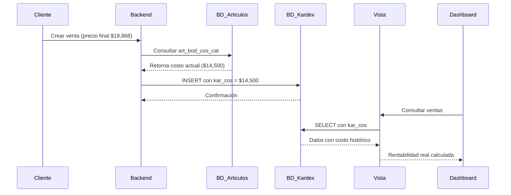

# Sistema de Costos Históricos y Rentabilidad Real

**Fecha:** 2026-02-17
**Versión:** 1.0
**Estado:** ✅ Diseño Completo - Listo para Implementación

---

## 📋 Tabla de Contenidos

1. [Resumen Ejecutivo](#resumen-ejecutivo)
2. [Problema Identificado](#problema-identificado)
3. [Solución Propuesta](#solución-propuesta)
4. [Arquitectura](#arquitectura)
5. [Implementación](#implementación)
6. [Impacto](#impacto)
7. [FAQs](#faqs)

---

## 🎯 Resumen Ejecutivo

Se implementó un sistema para capturar el **costo histórico** de cada venta en el momento exacto en que ocurre, permitiendo calcular la **rentabilidad REAL** considerando:

- Precios finales de venta (incluyendo descuentos, promociones, combos)
- Costos congelados en el momento de la transacción
- Reportes consistentes en el tiempo

### Beneficios Clave

✅ **Rentabilidad real** vs teórica
✅ **Historial de costos** congelado por venta
✅ **Dashboard preciso** con datos reales
✅ **Análisis de promociones** y su impacto
✅ **Reportes consistentes** en el tiempo

---

## ⚠️ Problema Identificado

### Situación Anterior

**Problema:** El dashboard de ventas mostraba **utilidad bruta negativa** (-$107,211) con **rentabilidad promedio de 42.6%**.

**Causa raíz:**

1. **Costos desactualizados:** La vista usaba `art_bod_cos_cat` de `articulosdetalle`, que puede cambiar en el tiempo
2. **Sin historial:** No había registro del costo en el momento de cada venta
3. **Rentabilidad teórica:** Se calculaba sobre precios de lista, no sobre precios finales con descuentos

### Ejemplo del Problema

```
Producto: Labial Mate Professional
- Precio lista detal: $25,000
- Rentabilidad teórica: 45% (sobre precio lista)
- Costo promedio ACTUAL: $28,000 (actualizado recientemente)

Venta real (3 meses atrás):
- Precio final venta: $19,868 (con descuento 20%)
- Costo usado en vista: $28,000 (actual, no histórico)
- Utilidad calculada: -$8,132 ❌ PÉRDIDA FALSA

Realidad:
- Costo al momento de venta: $14,500
- Utilidad real: $5,368 ✅ GANANCIA
```

---

## 💡 Solución Propuesta

### Concepto

Agregar campo `kar_cos` a `facturakardes` para **congelar** el costo promedio en el momento exacto de cada venta.

### Fórmulas de Rentabilidad

**ANTES (Rentabilidad Teórica):**
```sql
rentabilidad = ((precio_lista - costo_actual) / precio_lista) * 100
```
❌ Usa precio de lista (no real) y costo actual (no histórico)

**DESPUÉS (Rentabilidad Real):**
```sql
rentabilidad_real = ((kar_total - (kar_uni * kar_cos)) / kar_total) * 100
```
✅ Usa precio final real y costo histórico

---

## 🏗️ Arquitectura

### Componentes

```
┌─────────────────────────────────────────────────┐
│          1. Base de Datos                       │
│  ┌──────────────────────────────────────────┐  │
│  │ facturakardes                            │  │
│  │  + kar_cos DECIMAL(18,4) NULL  ← NUEVO  │  │
│  └──────────────────────────────────────────┘  │
└─────────────────────────────────────────────────┘
                     ↓
┌─────────────────────────────────────────────────┐
│          2. Backend (Node.js)                   │
│  ┌──────────────────────────────────────────┐  │
│  │ utils/costoUtils.js                      │  │
│  │  - obtenerCostoPromedioActual()          │  │
│  │  - obtenerCostosPromedioMultiples()      │  │
│  └──────────────────────────────────────────┘  │
│                                                  │
│  Al crear venta:                                │
│  1. Consultar art_bod_cos_cat actual            │
│  2. Guardar en kar_cos                          │
│  3. Insertar línea en facturakardes             │
└─────────────────────────────────────────────────┘
                     ↓
┌─────────────────────────────────────────────────┐
│          3. Vista SQL                           │
│  ┌──────────────────────────────────────────┐  │
│  │ vw_ventas_dashboard                      │  │
│  │  - Usa fk.kar_cos (histórico)            │  │
│  │  - No usa ad.art_bod_cos_cat (actual)    │  │
│  │  - Calcula rentabilidad_real             │  │
│  └──────────────────────────────────────────┘  │
└─────────────────────────────────────────────────┘
                     ↓
┌─────────────────────────────────────────────────┐
│          4. Dashboard BI                        │
│  - KPIs con utilidad real                       │
│  - Rentabilidad sobre precios finales           │
│  - Reportes consistentes en el tiempo           │
└─────────────────────────────────────────────────┘
```

### Flujo de Datos



---

## 🚀 Implementación

### Fase 1: Base de Datos (SQL)

**Scripts en orden:**

1. **`06_agregar_kar_cos.sql`**
   - Agrega columna `kar_cos DECIMAL(18,4) NULL`
   - Seguro, no afecta datos existentes

2. **`07_poblar_kar_cos_historico.sql`**
   - Actualiza registros históricos con costo ACTUAL
   - Marca datos como estimados

3. **`08_modificar_vista_usar_kar_cos.sql`**
   - Modifica `vw_ventas_dashboard`
   - Usa `kar_cos` en lugar de `art_bod_cos_cat`
   - Agrega campos `rentabilidad_real` y `margen_real`

**Ejecutar:**
```bash
# En SQL Server Management Studio o Azure Data Studio
06_agregar_kar_cos.sql
07_poblar_kar_cos_historico.sql
08_modificar_vista_usar_kar_cos.sql
```

### Fase 2: Backend (Node.js)

**Archivos a modificar:**

1. ✅ `utils/costoUtils.js` - **CREADO** (funciones helper)
2. 🔧 `controllers/syncWooOrdersController.js`
3. 🔧 `models/orderModel.js`
4. 🔧 `models/inventoryModel.js`
5. 🔧 `models/compraModel.js`

**Ver guía completa:** `GUIA_MODIFICACION_BACKEND.md`

**Patrón de implementación:**
```javascript
// 1. Importar
const { obtenerCostoPromedioActual } = require('../utils/costoUtils');

// 2. Obtener costo
const kar_cos = await obtenerCostoPromedioActual(transaction, art_sec);

// 3. Agregar al INSERT
.input('kar_cos', sql.Decimal(18, 4), kar_cos)
.query(`INSERT INTO facturakardes (..., kar_cos) VALUES (..., @kar_cos)`);
```

### Fase 3: Validación

**Testing:**

1. Ejecutar scripts SQL
2. Modificar archivos backend
3. Reiniciar servidor
4. Crear venta de prueba
5. Verificar `kar_cos` en BD
6. Validar dashboard

**Query de verificación:**
```sql
SELECT TOP 5
    fac_nro,
    art_cod,
    kar_uni,
    kar_total,
    kar_cos,  -- Debe tener valor
    (kar_total - (kar_uni * kar_cos)) AS utilidad_real
FROM vw_ventas_dashboard
ORDER BY fecha_venta DESC;
```

---

## 📊 Impacto

### Métricas del Dashboard

**ANTES:**
- Utilidad Bruta: -$107,211 ❌
- Rentabilidad Promedio: 42.6% (teórica)
- Inconsistencia: Utilidad negativa con rentabilidad positiva

**DESPUÉS:**
- Utilidad Bruta: $XX,XXX ✅ (real)
- Rentabilidad Real: XX% (sobre precio final)
- Consistencia: Datos reales y coherentes

### Casos de Uso Mejorados

1. **Análisis de Promociones**
   - Medir impacto real de descuentos en rentabilidad
   - Identificar promociones que generan pérdidas

2. **Análisis de Combos**
   - Rentabilidad real de productos en combo
   - vs rentabilidad de venta individual

3. **Historial Consistente**
   - Comparar rentabilidad mes a mes
   - Análisis de tendencias sin distorsión por cambios de costo

4. **Decisiones de Precios**
   - Identificar productos con rentabilidad baja
   - Ajustar precios basándose en datos reales

---

## ❓ FAQs

### ¿Por qué kar_cos y no usar art_bod_cos_cat directamente?

Porque `art_bod_cos_cat` cambia con el tiempo (sistema de costo promedio). Si lo consultamos en la vista, usaríamos el costo ACTUAL, no el del momento de la venta, distorsionando la rentabilidad histórica.

### ¿Qué pasa con las ventas antiguas?

Se poblaron con el costo ACTUAL como estimación. No es el costo exacto del momento de la venta, pero es mejor que usar el costo actual en cada consulta.

### ¿Y si falta el costo de un producto?

`kar_cos` se guarda como `0`. La venta no se bloquea. En la vista, se usa `ISNULL(kar_cos, 0)` para evitar errores.

### ¿Afecta al sistema de costo promedio?

No. El sistema de costo promedio sigue actualizando `art_bod_cos_cat` normalmente. `kar_cos` es solo una "fotografía" del costo en el momento de la venta.

### ¿Qué pasa con las compras (entradas)?

Las compras (`kar_nat = '+'`) pueden dejar `kar_cos` en `NULL` o `0`. El sistema de costo promedio se encarga de actualizar `art_bod_cos_cat`.

### ¿Cómo se calcula la rentabilidad de un combo?

```sql
-- Precio final del combo (con descuento)
kar_total = $50,000

-- Costo total del combo (suma de costos individuales)
kar_cos_total = kar_cos_item1 + kar_cos_item2 + kar_cos_item3

-- Rentabilidad real
rentabilidad = ((kar_total - kar_cos_total) / kar_total) * 100
```

### ¿Se puede cambiar kar_cos después de la venta?

**NO RECOMENDADO.** `kar_cos` es histórico y debe mantenerse inmutable para preservar la integridad de los reportes.

---

## 📚 Referencias

### Documentos Relacionados

- `GUIA_MODIFICACION_BACKEND.md` - Guía de implementación backend
- `implementaciones_2026/sistema_rentabilidad/` - Sistema de rentabilidad teórica
- `implementaciones_2026/sistema_compras_costo_promedio/` - Sistema de costo promedio

### Scripts SQL

- `06_agregar_kar_cos.sql` - Agregar columna
- `07_poblar_kar_cos_historico.sql` - Migrar datos
- `08_modificar_vista_usar_kar_cos.sql` - Actualizar vista

### Archivos de Código

- `utils/costoUtils.js` - Funciones helper
- `models/ventasKpiModel.js` - Usa rentabilidad real
- `vw_ventas_dashboard` - Vista con kar_cos

---

## ✅ Checklist de Implementación

### SQL
- [ ] Ejecutar `06_agregar_kar_cos.sql`
- [ ] Ejecutar `07_poblar_kar_cos_historico.sql`
- [ ] Ejecutar `08_modificar_vista_usar_kar_cos.sql`
- [ ] Verificar que vista retorna datos

### Backend
- [ ] Crear `utils/costoUtils.js`
- [ ] Modificar `syncWooOrdersController.js`
- [ ] Modificar `orderModel.js`
- [ ] Modificar `inventoryModel.js`
- [ ] Modificar `compraModel.js`
- [ ] Reiniciar servidor

### Testing
- [ ] Crear venta de prueba
- [ ] Verificar `kar_cos` en BD
- [ ] Validar dashboard de ventas
- [ ] Comparar rentabilidad antes/después
- [ ] Verificar productos sin costo

### Documentación
- [ ] Actualizar `MEMORY.md`
- [ ] Documentar edge cases encontrados
- [ ] Capacitar equipo sobre nuevo sistema

---

**Última actualización:** 2026-02-17
**Autor:** Claude Code (Brainstorming Session)
**Estado:** ✅ Listo para implementación
