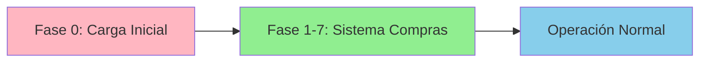
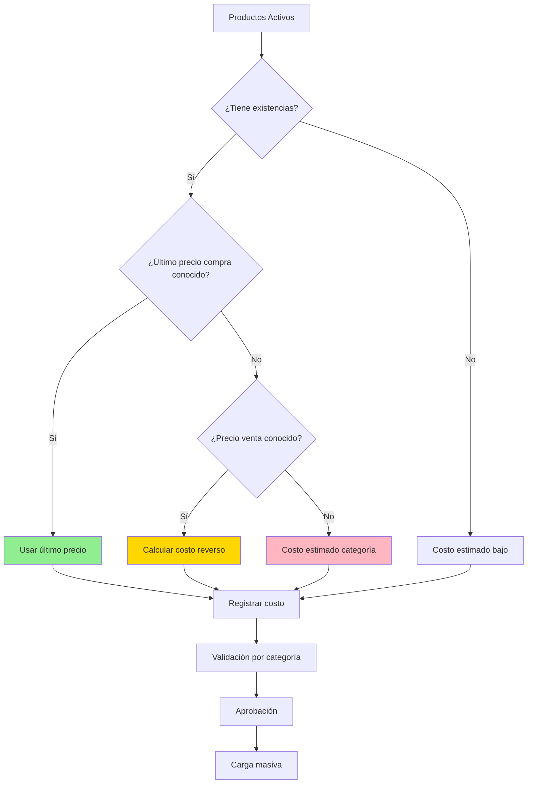

# Fase 0: Carga Inicial de Costos

**Fecha:** 2026-02-09
**Proyecto:** API Pretty - Sistema de Compras y Costo Promedio
**Documento relacionado:** ANALISIS_SISTEMA_COMPRAS_COSTO_PROMEDIO.md

---

## 📋 Tabla de Contenidos

1. [Contexto y Problema](#1-contexto-y-problema)
2. [Fórmula Validada según NIC 2](#2-fórmula-validada-según-nic-2)
3. [Particularidades para Productos de Maquillaje](#3-particularidades-para-productos-de-maquillaje)
4. [Estrategia de Carga Inicial](#4-estrategia-de-carga-inicial)
5. [Métodos de Obtención de Costos](#5-métodos-de-obtención-de-costos)
6. [Procedimientos Técnicos](#6-procedimientos-técnicos)
7. [Validación y Verificación](#7-validación-y-verificación)
8. [Casos Especiales](#8-casos-especiales)
9. [Plan de Ejecución](#9-plan-de-ejecución)

---

## 1. Contexto y Problema

### 1.1 Situación Actual

**❌ Problema identificado:**
- Actualmente **NO hay costos registrados** para ningún producto
- El campo `art_bod_cos_cat` en `articulosdetalle` está en NULL o $0
- No se puede implementar el sistema de costo promedio sin costos base

**✅ Necesidad:**
- Establecer **costos iniciales** para todos los productos activos
- Base sólida para el sistema de costo promedio ponderado
- Punto de partida para el cálculo de márgenes

### 1.2 Alcance de la Fase 0

Esta fase debe ejecutarse **ANTES** de implementar el sistema de compras:



**Criterios:**
- Solo productos **activos** (no es necesario cargar costos de inactivos)
- Priorizar productos con **existencias** actuales
- Costos pueden ser estimados inicialmente y ajustarse después
- Considerar último precio de compra conocido

---

## 2. Fórmula Validada según NIC 2

### 2.1 Marco Normativo en Colombia

Según la **NIC 2 - Inventarios** aplicable en Colombia (2026):

> "El costo de cada unidad de producto se determinará a partir del **promedio ponderado** del costo de los artículos similares, poseídos al principio del periodo, y del costo de los mismos artículos comprados o producidos durante el periodo."

**Referencias normativas:**
- [NIC 2 Inventarios - Supersociedades Colombia](https://www.supersociedades.gov.co/documents/80312/341848/04_NIC_2_Inventarios.pdf/)
- [Valoración de inventarios por promedio ponderado - Actualícese](https://actualicese.com/valoracion-de-inventarios-por-el-metodo-de-promedio-ponderado/)
- [Método del promedio ponderado - Gerencie.com](https://www.gerencie.com/metodo-del-promedio-ponderado.html)

### 2.2 Fórmula Oficial

**Fórmula según NIC 2:**

```
Costo Promedio Ponderado = Costo de bienes disponibles para la venta
                          ─────────────────────────────────────────
                          Total unidades disponibles para la venta
```

**Aplicado a una nueva compra (Promedio Móvil):**

```
Nuevo Costo Promedio = (Valor Inventario Actual + Valor Compra Nueva)
                       ─────────────────────────────────────────────
                       (Cantidad Actual + Cantidad Compra)

Donde:
• Valor Inventario Actual = Cantidad en stock × Costo promedio actual
• Valor Compra Nueva = Cantidad comprada × Costo unitario de compra
```

### 2.3 Ejemplo Validado

**Caso real de empresa de cosméticos:**

```
Inventario inicial:
- Producto: Labial Rojo Mate
- Cantidad: 20 unidades
- Costo actual: $15,000
- Valor total: $300,000

Nueva compra:
- Cantidad: 30 unidades
- Costo: $18,000
- Valor: $540,000

Cálculo:
Nuevo Costo Promedio = ($300,000 + $540,000) / (20 + 30)
                     = $840,000 / 50
                     = $16,800
```

**Resultado validado:**
- ✅ Nuevo inventario: 50 unidades
- ✅ Nuevo costo promedio: $16,800
- ✅ Nuevo valor total: $840,000

### 2.4 Validación de la Fórmula

✅ **La fórmula en el análisis original es CORRECTA**
✅ Cumple con NIC 2
✅ Aceptada por DIAN en Colombia
✅ Ampliamente usada en empresas minoristas colombianas

---

## 3. Particularidades para Productos de Maquillaje

### 3.1 Características del Sector Cosméticos/Maquillaje

**Factores que afectan el costeo:**

1. **Alta rotación de productos:** Tendencias y modas cambiantes
2. **Productos importados:** Costos afectados por TRM (tasa de cambio)
3. **Fechas de vencimiento:** Pérdidas por productos vencidos
4. **Variaciones de empaque:** Mismo producto, diferentes presentaciones
5. **Múltiples proveedores:** Variabilidad en precios de compra
6. **Productos de marca vs genéricos:** Diferentes estructuras de costo
7. **Impuestos especiales:** IVA en cosméticos en Colombia

### 3.2 Componentes del Costo en Maquillaje (Proveedores Nacionales)

**Según NIC 2, el costo debe incluir:**

```
Costo del Producto = Precio de compra (COP)
                   + Transporte y manejo
                   + Otros costos directos
                   - Descuentos comerciales
```

**Ejemplo práctico (Proveedor Nacional):**

```
Compra de Máscaras de Pestañas (proveedor Bogotá):
───────────────────────────────────────────────────
Precio unitario proveedor:         $35,000 COP × 50 unidades
Subtotal:                          $1,750,000 COP

Transporte Bogotá → Bodega:        $50,000 COP
Manipulación en bodega:            $20,000 COP
─────────────────────────────────────────────
Costo total:                       $1,820,000 COP
Costo unitario:                    $36,400 COP/unidad
```

**Nota para Fase 0:** Solo manejar proveedores nacionales (pesos colombianos). El sistema soportará importaciones en el futuro, pero no es necesario en esta fase inicial.

### 3.3 Consideraciones Especiales

#### 3.3.1 Productos con Fecha de Vencimiento
⚠️ **Importante:** Productos de maquillaje tienen vida útil limitada

**Recomendaciones:**
- Registrar fecha de vencimiento en sistema
- Considerar merma por vencimiento al calcular márgenes
- Política de rotación FEFO (First Expired, First Out)

#### 3.3.2 Productos Importados (Futuro)
**Situación actual:** Todos los productos son de proveedores nacionales (COP).

**Consideración futura:** El sistema está diseñado para soportar importaciones en el futuro:
- Manejo de TRM (tasa de cambio)
- Aranceles e impuestos de importación
- Fletes internacionales

**Para Fase 0:** Ignorar este tema, solo manejar costos en pesos colombianos (COP).

#### 3.3.3 Muestras y Productos Promocionales
✅ **Confirmado:** Se permitirán costos en $0 para muestras gratis

**Opciones de registro:**
1. **Costo cero:** Para muestras donadas por proveedores
2. **Costo simbólico:** $1 para mantener trazabilidad
3. **Costo promedio del lote:** Si la muestra sale del inventario regular

---

## 4. Estrategia de Carga Inicial

### 4.1 Enfoque Recomendado



### 4.2 Metodologías de Estimación

#### Método 1: Último Precio de Compra (Más confiable)
```sql
-- Si tienes facturas de proveedores en papel o sistema antiguo
-- Buscar última compra de cada producto y usar ese costo
```

**Ventajas:**
- ✅ Dato real y verificable
- ✅ Refleja precio actual del mercado
- ✅ Base sólida para futuras compras

**Desventajas:**
- ⚠️ Requiere revisar facturas físicas/digitales
- ⚠️ Puede ser laborioso para muchos productos

#### Método 2: Costo Reverso desde Precio de Venta
```
Costo Estimado = Precio de Venta / (1 + Margen Objetivo)

Ejemplo:
- Precio de venta detal: $45,000
- Margen objetivo sector maquillaje: 50%
- Costo estimado = $45,000 / 1.50 = $30,000
```

**Márgenes típicos en cosmética Colombia:**
- Productos masivos: 40-50%
- Productos premium: 50-70%
- Productos importados exclusivos: 60-80%

#### Método 3: Costo por Categoría
```
-- Definir costo promedio por subcategoría
Ejemplo para tu sistema:

inv_sub_gru_cod  | Subcategoría        | Costo Promedio Referencia
─────────────────────────────────────────────────────────────────
1                | Labiales            | $25,000
2                | Sombras             | $30,000
3                | Base/Correctores    | $40,000
4                | Máscaras pestañas   | $35,000
5                | Brochas             | $20,000
```

#### Método 4: Proveedor + Factura Reciente
Si tienen relación con proveedores:
- Solicitar última lista de precios
- Negociar descuentos retroactivos
- Usar precio de lista actual

### 4.3 Priorización de Productos

**Orden recomendado:**

1. **Prioridad ALTA:** Productos con existencias actuales
2. **Prioridad MEDIA:** Productos activos sin existencias (próximos a comprar)
3. **Prioridad BAJA:** Productos sin movimiento en 6+ meses
4. **No cargar:** Productos inactivos

**Query de priorización:**

```sql
SELECT
    a.art_sec,
    a.art_cod,
    a.art_nom,
    ISNULL(ve.existencia, 0) AS existencia,
    ad.art_bod_cos_cat AS costo_actual,
    CASE
        WHEN ISNULL(ve.existencia, 0) > 0 THEN 'ALTA'
        WHEN ISNULL(ve.existencia, 0) = 0 AND a.art_sec IS NOT NULL THEN 'MEDIA'
        ELSE 'BAJA'
    END AS prioridad
FROM articulos a
LEFT JOIN vwExistencias ve ON ve.art_sec = a.art_sec
LEFT JOIN articulosdetalle ad ON ad.art_sec = a.art_sec
    AND ad.bod_sec = '1'
    AND ad.lis_pre_cod = 1
WHERE a.art_sec IS NOT NULL  -- Asumiendo que hay un campo de estado
ORDER BY
    CASE
        WHEN ISNULL(ve.existencia, 0) > 0 THEN 1
        ELSE 2
    END,
    a.art_nom
```

---

## 5. Métodos de Obtención de Costos

### 5.1 Opción A: Carga Manual Individual (Productos Clave)

**Para productos de alta rotación o valor:**

**Interfaz sugerida:**
```
┌─────────────────────────────────────────────────────────┐
│ Cargar Costo Inicial - Producto Individual             │
├─────────────────────────────────────────────────────────┤
│ Código SKU: [RB001          ]  [Buscar]                │
│                                                         │
│ Producto: Labial Rojo Rubí Mate 3.5g                   │
│ Categoría: Labiales                                     │
│ Existencia actual: 45 unidades                          │
│                                                         │
│ ┌─────────────────────────────────────────────────┐   │
│ │ Método de cálculo:                              │   │
│ │ ○ Último precio de compra                       │   │
│ │ ● Costo reverso desde precio venta              │   │
│ │ ○ Costo estimado manual                         │   │
│ └─────────────────────────────────────────────────┘   │
│                                                         │
│ Precio de venta (detal): $ 45,000                      │
│ Margen objetivo (%):     [  50 ]                       │
│ ─────────────────────────────────────────              │
│ Costo calculado:         $ 30,000                      │
│                                                         │
│ Ajustar costo (opcional): [30,000    ]                 │
│                                                         │
│ Observaciones: [Costo estimado según precio venta]    │
│                                                         │
│           [Cancelar]          [Guardar Costo]          │
└─────────────────────────────────────────────────────────┘
```

### 5.2 Opción B: Carga Masiva por Excel ⭐ RECOMENDADA

**Para carga inicial rápida de muchos productos:**

**Plantilla Excel:**

```
categoria    | subcategoria | art_cod | art_nom                  | existencia | precio_venta | costo_inicial | metodo        | observaciones
────────────────────────────────────────────────────────────────────────────────────────────────────────────────────────────────────────────────
Labiales     | Mate         | RB001   | Labial Rojo Rubí         | 45         | 45000        | 30000         | REVERSO_50%   | Estimado
Sombras      | Mate         | SM002   | Sombra Mate Bronze       | 30         | 38000        | 25000         | ULTIMA_COMPRA | Factura PRV-123
Base         | Líquida      | BS003   | Base Suave Tono Natural  | 20         | 65000        | 42000         | REVERSO_55%   | Premium
```

**Columnas explicadas:**

| Columna | Tipo | Editable | Descripción |
|---------|------|----------|-------------|
| `categoria` | Texto | ❌ NO | Categoría del producto (para filtrar) |
| `subcategoria` | Texto | ❌ NO | Subcategoría (para filtrar) |
| `art_cod` | Texto | ❌ NO | SKU del producto |
| `art_nom` | Texto | ❌ NO | Nombre del producto |
| `existencia` | Número | ❌ NO | Cantidad en stock actual |
| `precio_venta` | Moneda | ❌ NO | Precio de venta detal |
| **`costo_inicial`** | **Moneda** | **✅ SÍ** | **USUARIO LLENA ESTA COLUMNA** |
| `metodo` | Lista | ✅ SÍ | Cómo se obtuvo el costo |
| `observaciones` | Texto | ✅ SÍ | Notas adicionales |

**Proceso de trabajo por categorías:**
1. Sistema exporta Excel con TODOS los productos activos
2. Usuario filtra por categoría (ej: "Labiales")
3. Usuario completa `costo_inicial` solo para esa categoría
4. Usuario importa archivo (solo se procesan filas con costo)
5. Sistema valida e importa
6. Usuario repite con siguiente categoría
7. Al volver a importar mismo archivo: **se ACTUALIZA lo existente, se CREA lo nuevo**

**✅ Importación incremental:** NO genera errores de duplicados, actualiza registros existentes

### 5.3 Opción C: Script SQL Automático (Estimación Inicial)

Para productos sin información, aplicar regla general:

```sql
-- Script de carga masiva con costo reverso genérico
UPDATE ad
SET ad.art_bod_cos_cat = (ad.art_bod_pre / 1.50)  -- Asume margen 50%
FROM articulosdetalle ad
INNER JOIN articulos a ON a.art_sec = ad.art_sec
WHERE ad.bod_sec = '1'
  AND ad.lis_pre_cod = 1
  AND (ad.art_bod_cos_cat IS NULL OR ad.art_bod_cos_cat = 0)
  AND ad.art_bod_pre > 0  -- Solo si tiene precio de venta
```

⚠️ **Precaución:** Este método es menos preciso, requiere revisión posterior.

---

## 6. Procedimientos Técnicos

### 6.1 Estructura de Tabla para Carga Temporal

**Crear tabla temporal para validación:**

```sql
CREATE TABLE carga_inicial_costos (
    cic_id INT IDENTITY(1,1) PRIMARY KEY,
    cic_art_sec VARCHAR(30) NOT NULL,
    cic_art_cod VARCHAR(30) NULL,
    cic_art_nom VARCHAR(100) NULL,
    cic_existencia DECIMAL(17,2) NULL,
    cic_precio_venta_detal DECIMAL(17,2) NULL,
    cic_precio_venta_mayor DECIMAL(17,2) NULL,
    cic_costo_propuesto DECIMAL(17,2) NOT NULL,
    cic_metodo_calculo VARCHAR(50) NULL,  -- 'ULTIMA_COMPRA', 'REVERSO', 'ESTIMADO', 'MANUAL'
    cic_margen_resultante_detal DECIMAL(5,2) NULL,  -- Calculado
    cic_margen_resultante_mayor DECIMAL(5,2) NULL,  -- Calculado
    cic_observaciones VARCHAR(500) NULL,
    cic_estado VARCHAR(20) DEFAULT 'PENDIENTE',  -- 'PENDIENTE', 'VALIDADO', 'APLICADO', 'RECHAZADO'
    cic_fecha_carga DATETIME DEFAULT GETDATE(),
    cic_usuario_carga VARCHAR(100) NULL,
    cic_fecha_validacion DATETIME NULL,
    cic_usuario_validacion VARCHAR(100) NULL,

    CONSTRAINT FK_carga_inicial_articulos FOREIGN KEY (cic_art_sec) REFERENCES articulos(art_sec)
)

CREATE INDEX IX_carga_inicial_estado ON carga_inicial_costos(cic_estado)
CREATE INDEX IX_carga_inicial_art_sec ON carga_inicial_costos(cic_art_sec)
```

### 6.2 Procedimiento de Validación Automática

```sql
CREATE PROCEDURE sp_ValidarCargaInicialCostos
AS
BEGIN
    -- Calcular márgenes resultantes
    UPDATE carga_inicial_costos
    SET
        cic_margen_resultante_detal = CASE
            WHEN cic_precio_venta_detal > 0
            THEN ((cic_precio_venta_detal - cic_costo_propuesto) / cic_precio_venta_detal * 100)
            ELSE NULL
        END,
        cic_margen_resultante_mayor = CASE
            WHEN cic_precio_venta_mayor > 0
            THEN ((cic_precio_venta_mayor - cic_costo_propuesto) / cic_precio_venta_mayor * 100)
            ELSE NULL
        END
    WHERE cic_estado = 'PENDIENTE'

    -- Validar costos negativos (CRÍTICO)
    UPDATE carga_inicial_costos
    SET
        cic_observaciones = ISNULL(cic_observaciones, '') + ' | ERROR: Costo negativo no permitido',
        cic_estado = 'RECHAZADO'
    WHERE cic_estado = 'PENDIENTE'
      AND cic_costo_propuesto < 0

    -- Validar costos mayores que precio de venta (ERROR)
    UPDATE carga_inicial_costos
    SET
        cic_observaciones = ISNULL(cic_observaciones, '') + ' | ERROR: Costo mayor que precio venta',
        cic_estado = 'RECHAZADO'
    WHERE cic_estado = 'PENDIENTE'
      AND cic_costo_propuesto >= cic_precio_venta_detal
      AND cic_costo_propuesto > 0  -- Excluir costos cero (muestras)

    -- Validar costos sospechosos (ALERTA)
    UPDATE carga_inicial_costos
    SET
        cic_observaciones = ISNULL(cic_observaciones, '') + ' | ALERTA: Margen muy bajo (<20%)',
        cic_estado = 'VALIDADO_CON_ALERTAS'
    WHERE cic_estado = 'PENDIENTE'
      AND cic_margen_resultante_detal < 20
      AND cic_costo_propuesto > 0

    -- Aprobar costos normales
    UPDATE carga_inicial_costos
    SET cic_estado = 'VALIDADO'
    WHERE cic_estado = 'PENDIENTE'
      AND (
          (cic_margen_resultante_detal >= 20 AND cic_costo_propuesto < cic_precio_venta_detal)
          OR cic_costo_propuesto = 0  -- Permitir muestras gratis
      )
END
```

### 6.3 Procedimiento de Aplicación de Costos (Con Soporte de Importación Incremental)

```sql
CREATE PROCEDURE sp_AplicarCargaInicialCostos
    @usuario VARCHAR(100)
AS
BEGIN
    DECLARE @total_aplicados INT = 0
    DECLARE @total_actualizados INT = 0
    DECLARE @total_nuevos INT = 0
    DECLARE @errores INT = 0

    BEGIN TRANSACTION

    BEGIN TRY
        -- Actualizar costos en articulosdetalle (IMPORTACIÓN INCREMENTAL)
        -- Si ya existe un registro en carga_inicial_costos para este art_sec:
        --   → ACTUALIZAR el costo
        -- Si no existe:
        --   → Se creará en la próxima importación

        UPDATE ad
        SET
            ad.art_bod_cos_cat = cic.cic_costo_propuesto
        FROM articulosdetalle ad
        INNER JOIN carga_inicial_costos cic ON cic.cic_art_sec = ad.art_sec
        WHERE ad.bod_sec = '1'
          AND ad.lis_pre_cod = 1
          AND cic.cic_estado = 'VALIDADO'

        SET @total_aplicados = @@ROWCOUNT
        SET @total_actualizados = @total_aplicados  -- Por ahora, todos son actualizaciones

        -- Marcar como aplicado
        UPDATE carga_inicial_costos
        SET
            cic_estado = 'APLICADO',
            cic_fecha_validacion = GETDATE(),
            cic_usuario_validacion = @usuario
        WHERE cic_estado = 'VALIDADO'

        -- Registrar en historial de costos
        INSERT INTO historial_costos (
            hc_art_sec,
            hc_fecha,
            hc_tipo_mov,
            hc_cantidad_antes,
            hc_costo_antes,
            hc_valor_antes,
            hc_cantidad_mov,
            hc_costo_mov,
            hc_cantidad_despues,
            hc_costo_despues,
            hc_valor_despues,
            hc_usu_cod
        )
        SELECT
            cic.cic_art_sec,
            GETDATE(),
            'CARGA_INICIAL',
            ISNULL(ve.existencia, 0),
            0,  -- Costo antes = 0
            0,  -- Valor antes = 0
            0,  -- No es una compra, es una inicialización
            cic.cic_costo_propuesto,
            ISNULL(ve.existencia, 0),
            cic.cic_costo_propuesto,
            ISNULL(ve.existencia, 0) * cic.cic_costo_propuesto,
            @usuario
        FROM carga_inicial_costos cic
        LEFT JOIN vwExistencias ve ON ve.art_sec = cic.cic_art_sec
        WHERE cic.cic_estado = 'APLICADO'

        COMMIT TRANSACTION

        SELECT
            @total_aplicados AS total_aplicados,
            @errores AS errores,
            'Carga inicial aplicada exitosamente' AS mensaje

    END TRY
    BEGIN CATCH
        ROLLBACK TRANSACTION

        SELECT
            ERROR_MESSAGE() AS mensaje_error,
            ERROR_LINE() AS linea_error

        RAISERROR('Error al aplicar carga inicial de costos', 16, 1)
    END CATCH
END
```

---

## 7. Validación y Verificación

### 7.1 Reporte de Validación Pre-Carga

**Query para revisar antes de aplicar:**

```sql
-- Resumen por categoría
SELECT
    isg.inv_sub_gru_nom AS categoria,
    COUNT(cic.cic_art_sec) AS total_productos,
    AVG(cic.cic_costo_propuesto) AS costo_promedio,
    MIN(cic.cic_costo_propuesto) AS costo_minimo,
    MAX(cic.cic_costo_propuesto) AS costo_maximo,
    AVG(cic.cic_margen_resultante_detal) AS margen_promedio_detal,
    COUNT(CASE WHEN cic.cic_estado = 'VALIDADO' THEN 1 END) AS validados,
    COUNT(CASE WHEN cic.cic_estado = 'RECHAZADO' THEN 1 END) AS rechazados,
    COUNT(CASE WHEN cic.cic_estado = 'VALIDADO_CON_ALERTAS' THEN 1 END) AS con_alertas
FROM carga_inicial_costos cic
INNER JOIN articulos a ON a.art_sec = cic.cic_art_sec
LEFT JOIN inventario_subgrupo isg ON isg.inv_sub_gru_cod = a.inv_sub_gru_cod
GROUP BY isg.inv_sub_gru_nom
ORDER BY total_productos DESC
```

### 7.2 Productos Requieren Revisión

```sql
-- Listar productos con alertas
SELECT
    cic.cic_art_cod,
    cic.cic_art_nom,
    cic.cic_costo_propuesto,
    cic.cic_precio_venta_detal,
    cic.cic_margen_resultante_detal,
    cic.cic_estado,
    cic.cic_observaciones
FROM carga_inicial_costos cic
WHERE cic.cic_estado IN ('RECHAZADO', 'VALIDADO_CON_ALERTAS')
ORDER BY cic.cic_margen_resultante_detal ASC
```

### 7.3 Verificación Post-Carga

```sql
-- Verificar que se aplicaron los costos
SELECT
    COUNT(*) AS total_productos_activos,
    COUNT(CASE WHEN ad.art_bod_cos_cat > 0 THEN 1 END) AS con_costo_asignado,
    COUNT(CASE WHEN ad.art_bod_cos_cat IS NULL OR ad.art_bod_cos_cat = 0 THEN 1 END) AS sin_costo,
    AVG(ad.art_bod_cos_cat) AS costo_promedio_sistema
FROM articulos a
INNER JOIN articulosdetalle ad ON ad.art_sec = a.art_sec
WHERE ad.bod_sec = '1'
  AND ad.lis_pre_cod = 1
```

---

## 8. Casos Especiales

### 8.1 Productos con Existencias pero sin Precio de Venta

**Problema:**
- Producto en inventario
- No tiene precio de venta configurado
- ¿Cómo asignar costo?

**Solución:**
1. Revisar manualmente (puede ser producto descontinuado)
2. Buscar en facturas de proveedores
3. Si no hay información: Asignar costo simbólico ($1) y marcar para revisión

```sql
UPDATE articulosdetalle
SET art_bod_cos_cat = 1  -- Costo simbólico
WHERE art_sec IN (
    SELECT a.art_sec
    FROM articulos a
    INNER JOIN vwExistencias ve ON ve.art_sec = a.art_sec
    LEFT JOIN articulosdetalle ad ON ad.art_sec = a.art_sec
        AND ad.bod_sec = '1'
        AND ad.lis_pre_cod = 1
    WHERE ve.existencia > 0
      AND (ad.art_bod_pre IS NULL OR ad.art_bod_pre = 0)
)
```

### 8.2 Trabajo por Categorías (Importación Incremental)

**Caso de uso común:**
- Usuario tiene 250 productos en total
- Quiere trabajar por categorías para no confundirse

**Flujo recomendado:**

**Paso 1:** Usuario exporta Excel completo (250 productos)

**Paso 2:** Usuario filtra en Excel por categoría "Labiales" (30 productos)

**Paso 3:** Usuario completa `costo_inicial` solo para labiales

**Paso 4:** Usuario importa Excel
```
Resultado:
✓ Nuevos: 30
✓ Actualizados: 0
✓ Ignorados: 220 (sin costo aún)
```

**Paso 5:** Usuario filtra por categoría "Sombras" (40 productos)

**Paso 6:** Usuario completa `costo_inicial` para sombras

**Paso 7:** Usuario importa EL MISMO EXCEL nuevamente
```
Resultado:
✓ Nuevos: 40 (sombras)
✓ Actualizados: 30 (labiales ya existían, se actualizan por si cambió algo)
✓ Ignorados: 180
```

**Ventaja:** NO genera error de "registro duplicado", el sistema actualiza inteligentemente

### 8.3 Productos en Consignación

**Problema:**
- Productos de terceros en tu inventario
- No hay costo de compra (no son tuyos)

**Solución:**
1. **Opción A:** No asignar costo (dejar en NULL o $0)
2. **Opción B:** Asignar costo de venta acordado con consignante
3. **Opción C:** Crear categoría especial "CONSIGNACION"

### 8.4 Productos en Promoción Permanente

**Problema:**
- Precio de venta muy bajo (promocional)
- Costo reverso da margen negativo o muy bajo

**Solución:**
- Buscar precio "regular" (no promocional) para calcular costo
- O usar costo de productos similares de la categoría

### 8.5 Muestras Gratis

**Confirmado:** Se permitirá costo = $0

**Implementación:**
```sql
-- Permitir costo cero solo si tiene observación de "muestra"
INSERT INTO carga_inicial_costos (
    cic_art_sec,
    cic_costo_propuesto,
    cic_metodo_calculo,
    cic_observaciones
)
SELECT
    art_sec,
    0,  -- Costo cero
    'MUESTRA_GRATIS',
    'Muestra gratis de proveedor - Sin costo'
FROM articulos
WHERE art_cod LIKE 'MUESTRA%'  -- Ajustar según su nomenclatura
```

---

## 9. Plan de Ejecución

### 9.1 Cronograma Propuesto

```
┌─────────────────────────────────────────────────────────────────┐
│ FASE 0: Carga Inicial de Costos (7-10 días)                    │
├─────────────────────────────────────────────────────────────────┤
│                                                                 │
│ Día 1-2: Preparación                                           │
│   ✓ Crear tabla carga_inicial_costos                          │
│   ✓ Crear procedimientos SQL                                  │
│   ✓ Exportar listado de productos activos                     │
│   ✓ Clasificar por prioridad                                  │
│                                                                 │
│ Día 3-5: Recopilación de Información                          │
│   ✓ Revisar facturas de proveedores (últimos 3 meses)        │
│   ✓ Solicitar listas de precios a proveedores actuales       │
│   ✓ Identificar productos sin información                     │
│   ✓ Definir márgenes objetivo por categoría                   │
│                                                                 │
│ Día 6-7: Carga de Datos                                       │
│   ✓ Cargar costos conocidos (Método 1: Última compra)        │
│   ✓ Calcular costos reversos (Método 2: Desde precio venta)  │
│   ✓ Estimar costos faltantes (Método 3: Por categoría)       │
│   ✓ Registrar en tabla carga_inicial_costos                  │
│                                                                 │
│ Día 8: Validación                                             │
│   ✓ Ejecutar sp_ValidarCargaInicialCostos                    │
│   ✓ Revisar productos con alertas                            │
│   ✓ Ajustar costos sospechosos                               │
│   ✓ Generar reportes de validación                           │
│                                                                 │
│ Día 9: Revisión y Aprobación                                  │
│   ✓ Presentar reporte a gerencia                             │
│   ✓ Validar márgenes por categoría                           │
│   ✓ Aprobar carga masiva                                     │
│                                                                 │
│ Día 10: Aplicación                                            │
│   ✓ Backup de base de datos                                  │
│   ✓ Ejecutar sp_AplicarCargaInicialCostos                   │
│   ✓ Verificar carga exitosa                                  │
│   ✓ Generar reporte post-carga                               │
│                                                                 │
└─────────────────────────────────────────────────────────────────┘
```

### 9.2 Checklist de Ejecución

**Pre-requisitos:**
- [ ] Backup completo de base de datos
- [ ] Tabla `carga_inicial_costos` creada
- [ ] Procedimientos almacenados creados
- [ ] Usuario con permisos necesarios
- [ ] Listado de productos activos exportado

**Recopilación:**
- [ ] Facturas de proveedores revisadas (últimos 3-6 meses)
- [ ] Listas de precios de proveedores solicitadas
- [ ] Márgenes objetivo definidos por categoría
- [ ] Casos especiales identificados

**Carga:**
- [ ] Productos prioridad ALTA con costo asignado (con existencias)
- [ ] Productos prioridad MEDIA con costo asignado (sin existencias)
- [ ] Productos sin información con costo estimado
- [ ] Observaciones documentadas

**Validación:**
- [ ] Procedimiento de validación ejecutado
- [ ] Productos rechazados revisados manualmente
- [ ] Productos con alertas ajustados
- [ ] Reporte de validación generado

**Aplicación:**
- [ ] Backup pre-aplicación realizado
- [ ] Procedimiento de aplicación ejecutado
- [ ] Verificación post-carga completada
- [ ] Historial de costos registrado
- [ ] Reporte final generado

**Post-Carga:**
- [ ] Comunicar a equipo que costos están cargados
- [ ] Capacitar usuarios sobre sistema de compras
- [ ] Proceder con Fase 1: Preparación BD para compras

---

## 10. Plantillas y Recursos

### 10.1 Plantilla Excel para Carga Masiva

**Descargar:** `plantilla_carga_inicial_costos.xlsx`

**Columnas requeridas:**

| Columna | Tipo | Requerido | Descripción |
|---------|------|-----------|-------------|
| art_cod | Texto | SÍ | Código SKU del producto |
| art_nom | Texto | NO | Nombre (se auto-completa) |
| existencia | Número | NO | Cantidad en stock (se auto-completa) |
| precio_venta_detal | Moneda | NO | Precio detal actual (se auto-completa) |
| precio_venta_mayor | Moneda | NO | Precio mayor actual (se auto-completa) |
| **costo_inicial** | **Moneda** | **SÍ** | **Costo a cargar** |
| metodo_calculo | Lista | SÍ | ULTIMA_COMPRA / REVERSO / ESTIMADO / MANUAL |
| observaciones | Texto | NO | Notas adicionales |

**Validaciones en Excel:**
- `costo_inicial` > 0 (excepto muestras)
- `metodo_calculo` debe ser uno de los valores válidos
- Si `metodo_calculo` = "REVERSO", debe tener `precio_venta_detal`

### 10.2 Script de Importación desde Excel (Con Soporte Incremental)

```javascript
// Importación con soporte UPSERT (actualizar si existe, insertar si es nuevo)
const XLSX = require('xlsx');
const { poolPromise, sql } = require('./db');

async function importarCargaInicialDesdeExcel(rutaArchivo, usuarioCarga) {
  const workbook = XLSX.readFile(rutaArchivo);
  const sheet = workbook.Sheets[workbook.SheetNames[0]];
  const datos = XLSX.utils.sheet_to_json(sheet);

  const pool = await poolPromise;
  const transaction = new sql.Transaction(pool);
  await transaction.begin();

  let procesados = 0;
  let actualizados = 0;
  let nuevos = 0;
  let ignorados = 0;

  try {
    for (const fila of datos) {
      // Validar que tenga costo (ignorar filas vacías)
      if (!fila.art_cod || fila.costo_inicial === null || fila.costo_inicial === undefined || fila.costo_inicial === '') {
        ignorados++;
        continue;
      }

      // Obtener art_sec desde art_cod
      const result = await transaction.request()
        .input('art_cod', sql.VarChar(30), fila.art_cod)
        .query('SELECT art_sec FROM articulos WHERE art_cod = @art_cod');

      if (result.recordset.length === 0) {
        console.warn(`Producto no encontrado: ${fila.art_cod}`);
        ignorados++;
        continue;
      }

      const art_sec = result.recordset[0].art_sec;

      // IMPORTACIÓN INCREMENTAL: Verificar si ya existe
      const existeResult = await transaction.request()
        .input('art_sec', sql.VarChar(30), art_sec)
        .query('SELECT cic_id FROM carga_inicial_costos WHERE cic_art_sec = @art_sec');

      if (existeResult.recordset.length > 0) {
        // YA EXISTE → ACTUALIZAR
        await transaction.request()
          .input('art_sec', sql.VarChar(30), art_sec)
          .input('costo', sql.Decimal(17, 2), fila.costo_inicial)
          .input('metodo', sql.VarChar(50), fila.metodo || 'MANUAL')
          .input('obs', sql.VarChar(500), fila.observaciones || '')
          .input('usuario', sql.VarChar(100), usuarioCarga)
          .query(`
            UPDATE carga_inicial_costos
            SET
              cic_costo_propuesto = @costo,
              cic_metodo_calculo = @metodo,
              cic_observaciones = @obs,
              cic_estado = 'PENDIENTE',  -- Resetear para re-validar
              cic_fecha_carga = GETDATE(),
              cic_usuario_carga = @usuario
            WHERE cic_art_sec = @art_sec
          `);
        actualizados++;
      } else {
        // NO EXISTE → INSERTAR
        await transaction.request()
          .input('art_sec', sql.VarChar(30), art_sec)
          .input('costo', sql.Decimal(17, 2), fila.costo_inicial)
          .input('metodo', sql.VarChar(50), fila.metodo || 'MANUAL')
          .input('obs', sql.VarChar(500), fila.observaciones || '')
          .input('usuario', sql.VarChar(100), usuarioCarga)
          .query(`
            INSERT INTO carga_inicial_costos (
              cic_art_sec,
              cic_costo_propuesto,
              cic_metodo_calculo,
              cic_observaciones,
              cic_usuario_carga
            ) VALUES (
              @art_sec,
              @costo,
              @metodo,
              @obs,
              @usuario
            )
          `);
        nuevos++;
      }

      procesados++;
    }

    await transaction.commit();
    console.log(`
      ✓ Importación completada:
      - Total procesados: ${procesados}
      - Nuevos: ${nuevos}
      - Actualizados: ${actualizados}
      - Ignorados (sin costo): ${ignorados}
    `);

    // Ejecutar validación automática
    await pool.request().execute('sp_ValidarCargaInicialCostos');
    console.log('✓ Validación automática completada');

    return {
      success: true,
      procesados,
      nuevos,
      actualizados,
      ignorados
    };

  } catch (error) {
    await transaction.rollback();
    console.error('Error en importación:', error);
    throw error;
  }
}

module.exports = { importarCargaInicialDesdeExcel };
```

**Ventajas de este diseño:**

✅ **Importación incremental:** Usuario puede importar múltiples veces sin errores
✅ **Trabajo por categorías:** Usuario filtra Excel por categoría, llena costos, importa
✅ **Actualizaciones:** Si cambia un costo y vuelve a importar, se actualiza
✅ **Sin duplicados:** Sistema detecta registros existentes y los actualiza
✅ **Auditoría:** Registra quién y cuándo se cargó/actualizó cada costo

---

## 11. Preguntas Frecuentes (FAQ)

### Q1: ¿Es obligatorio cargar costos para todos los productos?
**R:** No, solo para productos **activos**. Productos inactivos o descontinuados no requieren costo.

### Q2: ¿Puedo ajustar los costos después de la carga inicial?
**R:** Sí, los costos se actualizarán automáticamente con cada compra usando el promedio ponderado.

### Q3: ¿Qué pasa si me equivoco en un costo durante la carga inicial?
**R:** Puedes corregirlo manualmente en la tabla `carga_inicial_costos` antes de ejecutar `sp_AplicarCargaInicialCostos`. Después de aplicado, deberás crear un ajuste manual en el sistema.

### Q4: ¿Los costos cargados afectarán el inventario?
**R:** No, esta carga solo establece el **costo unitario** en `art_bod_cos_cat`. Las existencias no cambian.

### Q5: ¿Debo cargar costos incluyendo IVA?
**R:** **NO**. El costo debe ser el valor **sin IVA** (valor neto de compra).

### Q6: ¿Qué margen es "saludable" para productos de maquillaje?
**R:**
- Productos masivos: 40-50%
- Productos premium: 50-70%
- Productos exclusivos: 60-80%

### Q7: ¿Puedo cargar costos por lotes/categorías?
**R:** Sí, puedes usar el Método 3 (Costo por Categoría) para cargas masivas, pero es menos preciso.

### Q8: ¿Qué hago con productos que no tengo información de costo?
**R:** Usa el costo reverso desde precio de venta con un margen estimado (50% por defecto).

---

## 12. Consideraciones Finales

### 12.1 Riesgos de la Carga Inicial

| Riesgo | Impacto | Mitigación |
|--------|---------|------------|
| **Costos muy bajos** | Márgenes inflados, decisiones erróneas | Validación por categoría, revisar alertas |
| **Costos muy altos** | Márgenes negativos, precios no competitivos | Validación automática rechaza costos > precio venta |
| **Pérdida de datos** | Tener que repetir todo | Backup antes de aplicar, tabla temporal |
| **Errores de tipeo** | Costos incorrectos | Validación de rangos por categoría |
| **Productos duplicados** | Costos inconsistentes | Validar unicidad de art_sec en carga |

### 12.2 Beneficios Post-Carga

✅ **Inmediatos:**
- Sistema listo para registrar compras
- Cálculo de márgenes en tiempo real
- Base para análisis de rentabilidad

✅ **Mediano plazo:**
- Mejora de precios de venta basados en costos reales
- Identificación de productos poco rentables
- Negociación informada con proveedores

✅ **Largo plazo:**
- Historial de variación de costos
- Análisis de tendencias de precios
- Optimización de estrategia de compras

---

## 13. Próximo Paso

Una vez completada la **Fase 0**, proceder con:

**→ [Fase 1: Preparación de Base de Datos](ANALISIS_SISTEMA_COMPRAS_COSTO_PROMEDIO.md#fase-1-preparación-de-base-de-datos-1-2-días)**

Esto incluye:
- Crear tipo de comprobante `COM`
- Crear tabla `historial_costos`
- Crear procedimiento `sp_CalcularCostoPromedio`
- Crear vistas de consulta

---

## Referencias y Fuentes

### Normativa Colombia
- [NIC 2 Inventarios - Supersociedades Colombia](https://www.supersociedades.gov.co/documents/80312/341848/04_NIC_2_Inventarios.pdf/)
- [Costo promedio ponderado - DIAN Oficio 467](https://crconsultorescolombia.com/costo-de-venta-de-los-inventarios-costo-promedio-ponderado-dian-oficio-467914503.php)

### Guías Prácticas
- [Método del promedio ponderado - Gerencie.com](https://www.gerencie.com/metodo-del-promedio-ponderado.html)
- [Valoración de inventarios por promedio ponderado - Actualícese](https://actualicese.com/valoracion-de-inventarios-por-el-metodo-de-promedio-ponderado/)
- [Promedio ponderado en inventarios - Actualícese (control práctico)](https://actualicese.com/archivo/metodo-del-promedio-ponderado-para-el-control-de-inventarios/)
- [Métodos de valoración de inventarios - Ingenio Empresa](https://www.ingenioempresa.com/metodos-valoracion-inventarios/)

### Información Técnica
- [Valoración de inventarios - Contabilízalo](https://www.contabilizalo.com/ejemplo-metodo-promedio-ponderado-en-inventarios)
- [Precio medio ponderado - Mecalux Colombia](https://www.mecalux.com.co/blog/precio-medio-ponderado)

---

**Documento creado por:** Claude Code
**Fecha:** 2026-02-09
**Versión:** 1.0
**Relacionado con:** ANALISIS_SISTEMA_COMPRAS_COSTO_PROMEDIO.md
