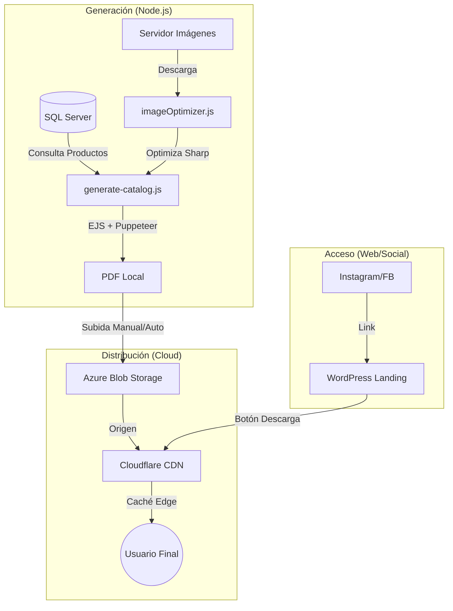

# Arquitectura Técnica: Catálogo PDF Optimizado

Este documento describe la arquitectura y el flujo de datos del sistema de generación y distribución de catálogos PDF para Pretty Makeup Colombia.

## Visión General

El sistema está diseñado para generar catálogos de alta calidad visual con un peso de archivo optimizado, y distribuirlos de forma masiva sin impactar el rendimiento del servidor web (WordPress).

## Componentes del Sistema

### 1. Generador de Catálogo (`poc-catalogo-pdf/`)
*   **Motor de Datos (`dbCatalogSimple.js`):** Extrae información directamente de SQL Server, filtrando por stock y categorías. No depende de WooCommerce para evitar sobrecarga.
*   **Optimizador de Imágenes (`imageOptimizer.js`):** Descarga imágenes originales y las procesa con `sharp` (300x300px, JPEG 85%). Utiliza un sistema de caché local para evitar re-procesamientos innecesarios.
*   **Generador PDF (`pdfGenerator.js`):** Transforma un template HTML (EJS) en PDF usando `puppeteer`. Diseñado en formato A4 Horizontal (Landscape) para mejor visualización en móviles.

### 2. Capa de Almacenamiento (Azure Blob Storage)
*   Funciona como el servidor de origen de archivos estáticos.
*   Proporciona alta disponibilidad y durabilidad para los archivos pesados (9MB - 25MB).
*   Configurado con un Dominio Personalizado (`catalogos.prettymakeupcol.com`) para integración profesional.

### 3. Capa de Aceleración (Cloudflare CDN)
*   **Caché Agresiva:** Configurado con reglas de caché (Edge TTL: 1 mes) para entregar el PDF desde servidores locales en Bogotá/Colombia.
*   **Seguridad:** Fuerza el uso de HTTPS (SSL Full) para la comunicación segura con Azure.
*   **Performance:** Reduce el tiempo de descarga de ~12s (directo de Azure) a <2s (desde caché).

## Flujo de Trabajo Operativo

1.  **Ejecución:** Se corre `node generate-catalog.js`.
2.  **Generación:** Se crea el archivo en `output/catalogo-YYYY-MM-DD...pdf`.
3.  **Despliegue:** Se sube el archivo a Azure Blob Storage.
4.  **Propagación:** Cloudflare detecta la primera petición, cachea el archivo y lo sirve de forma instantánea a los siguientes usuarios.

## Métricas de Éxito
*   **Peso del PDF:** < 25MB (Promedio actual: 9.1MB para 600+ productos).
*   **Tiempo de entrega:** < 3 segundos (vía CDN).
*   **Capacidad:** Soporta miles de descargas concurrentes sin coste incremental significativo.
